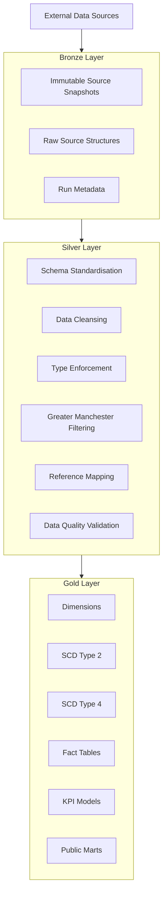
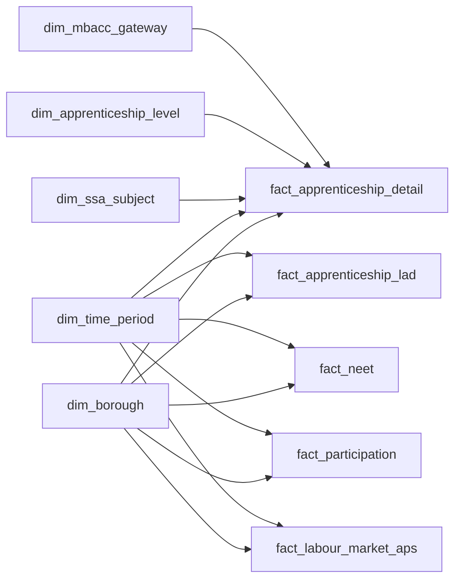
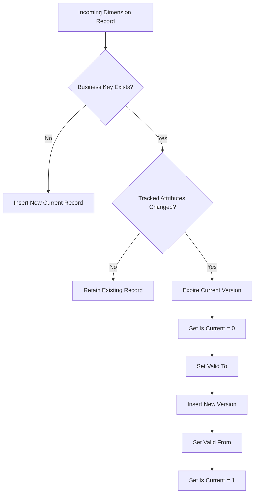
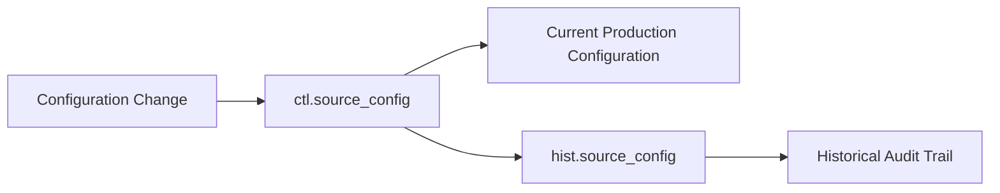
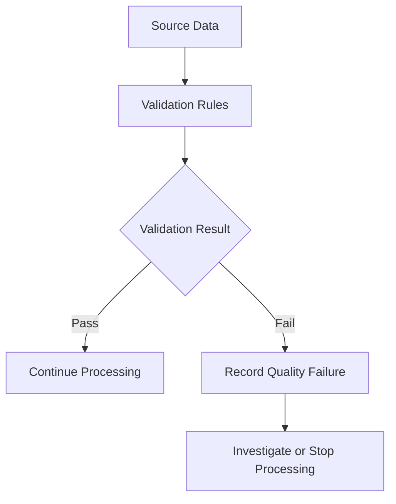
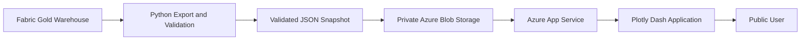
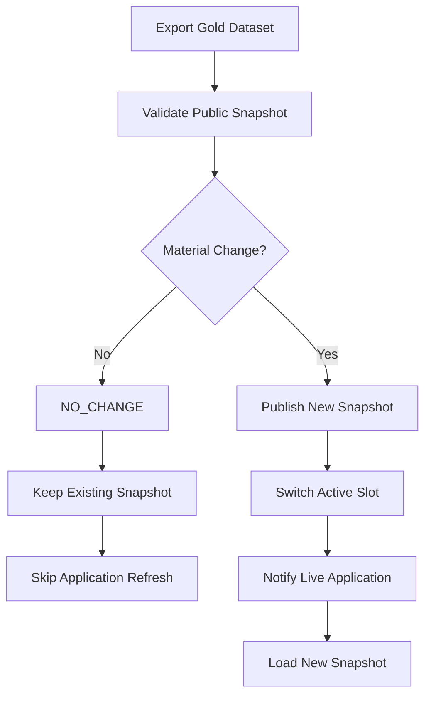
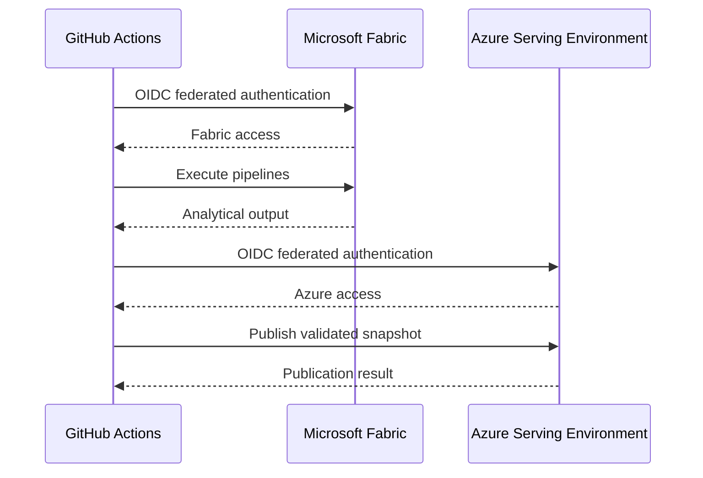
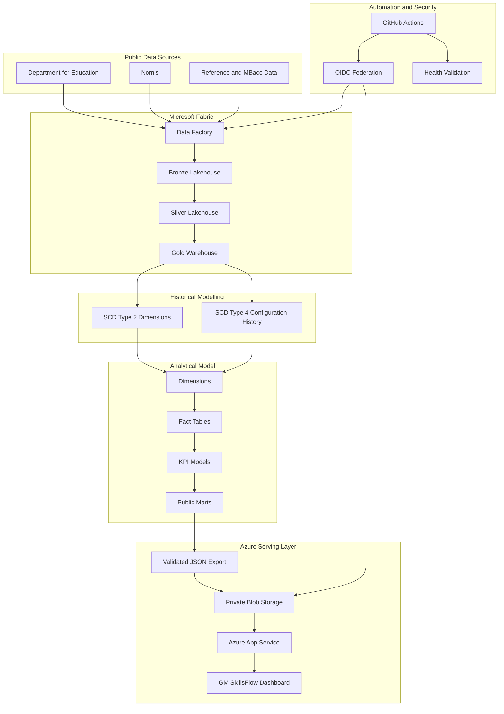

# Greater Manchester Skills & Opportunity Intelligence Live Platform


# Live Dashboard Platform - https://gm-skillsflow-kamil-898341.azurewebsites.net/
# Project Full Documentation - https://medium.com/@kamilkenny22/building-gm-skillsflow-from-fragmented-public-data-to-a-governed-skills-intelligence-platform-with-3a7c35c9dac4?postPublishedType=repub 
# The Power BI DashBoard


**GM SkillsFlow** is an end to end data engineering, analytics and public intelligence platform designed to bring together fragmented education, apprenticeship, youth transition and labour market data for Greater Manchester.

The platform integrates data from multiple public sources, processes them through a Microsoft Fabric Medallion architecture, builds governed dimensional and fact models in a Fabric Warehouse, preserves analytical and operational history using **Slowly Changing Dimension Type 2 and Type 4 patterns**, and publishes validated intelligence through a live Azure hosted web application and Power BI web Dashboard.

The project demonstrates a production style data engineering lifecycle covering:

- Multi source data ingestion
- Microsoft Fabric Data Factory pipelines
- Bronze, Silver and Gold architecture
- Immutable source preservation
- Data cleansing and standardisation
- Data quality validation
- Dimensional modelling
- Fact table engineering
- SCD Type 2 historisation
- SCD Type 4 historical configuration management
- Microsoft Fabric Warehouse
- Python based public data export
- Azure Blob Storage
- Azure App Service
- Plotly Dash
- Power BI Web Dash
- GitHub Actions automation
- OpenID Connect authentication
- Managed Identity
- Change aware snapshot publication
- Automated application health validation

---

# Project Overview

Public information relating to skills, apprenticeships, youth participation and labour market conditions is distributed across several datasets, publishing organisations and reporting structures.

GM SkillsFlow was developed to bring these sources together into a consistent analytical environment.

Rather than treating each source independently, the platform creates shared dimensions and analytical models that allow education, skills and labour market indicators to be explored together.

The platform supports questions such as:

> How are apprenticeship outcomes changing across Greater Manchester?

> Which boroughs show stronger or weaker youth participation and transition outcomes?

> How does labour market participation vary across Greater Manchester?

> Which apprenticeship subject areas and MBacc pathways have greater representation?

> How can skills supply, youth participation and labour market indicators be analysed within a common model?

The project therefore goes beyond dashboard development.

It demonstrates how heterogeneous public datasets can be acquired, preserved, transformed, modelled, validated, automated and securely served through a production style cloud architecture.

---

# Live Application

The deployed GM SkillsFlow platform is available at:

**https://gm-skillsflow-kamil-898341.azurewebsites.net**

Application health endpoint:

**https://gm-skillsflow-kamil-898341.azurewebsites.net/healthz**

---

# High Level Architecture
flowchart LR

    DFE[Department for Education]
    NOMIS[Nomis]
    REF[Reference and MBacc Data]

    FABRIC[Microsoft Fabric Data Factory]

    BRONZE[Bronze Lakehouse]
    SILVER[Silver Lakehouse]
    GOLD[Gold Fabric Warehouse]

    EXPORT[Validated Public Export]
    BLOB[Private Azure Blob Storage]
    APP[Azure App Service]
    DASH[GM SkillsFlow Dashboard]

    GH[GitHub Actions]

    DFE --> FABRIC
    NOMIS --> FABRIC
    REF --> FABRIC

    FABRIC --> BRONZE
    BRONZE --> SILVER
    SILVER --> GOLD

    GOLD --> EXPORT
    EXPORT --> BLOB
    BLOB --> APP
    APP --> DASH

    GH --> FABRIC
    GH --> EXPORT
    GH --> BLOB
    GH --> APP
    Power BI Dashboard
```

The architecture deliberately separates:

```text
Source acquisition
        ↓
Raw data preservation
        ↓
Data engineering
        ↓
Analytical modelling
        ↓
Public publication
        ↓
Application serving
```

This prevents the public dashboard from depending directly on operational source systems.

---

# End to End Data Flow

```text
┌─────────────────────────────────────┐
│          PUBLIC DATA SOURCES        │
│                                     │
│ Department for Education            │
│ Nomis                               │
│ Reference and MBacc mappings        │
└─────────────────┬───────────────────┘
                  │
                  ▼
┌─────────────────────────────────────┐
│      MICROSOFT FABRIC DATA FACTORY  │
│                                     │
│ Source ingestion pipelines          │
│ Pipeline orchestration              │
└─────────────────┬───────────────────┘
                  │
                  ▼
┌─────────────────────────────────────┐
│              BRONZE                 │
│                                     │
│ Immutable raw source snapshots      │
│ Source evidence                     │
│ Run metadata                        │
└─────────────────┬───────────────────┘
                  │
                  ▼
┌─────────────────────────────────────┐
│              SILVER                 │
│                                     │
│ Cleaning                            │
│ Standardisation                     │
│ Geography alignment                 │
│ Data quality validation             │
│ Reference mapping                   │
└─────────────────┬───────────────────┘
                  │
                  ▼
┌─────────────────────────────────────┐
│               GOLD                  │
│                                     │
│ Dimensions                          │
│ SCD Type 2                          │
│ SCD Type 4                          │
│ Fact tables                         │
│ KPI models                          │
│ Public marts                        │
└─────────────────┬───────────────────┘
                  │
                  ▼
┌─────────────────────────────────────┐
│        VALIDATED PUBLIC EXPORT      │
│                                     │
│ JSON analytical datasets            │
└─────────────────┬───────────────────┘
                  │
                  ▼
┌─────────────────────────────────────┐
│        AZURE SERVING LAYER          │
│                                     │
│ Private Blob Storage                │
│ Azure App Service                   │
│ Plotly Dash and Power BI Web        │
└─────────────────────────────────────┘
```

---

# Data Sources

The platform combines several independent data sources.

## Department for Education

Department for Education datasets provide the main education and youth transition component of the platform.

The ingestion process includes datasets covering areas such as:

- Apprenticeship participation
- Apprenticeship achievements
- Apprenticeship levels
- Sector Subject Areas
- Local authority apprenticeship statistics
- NEET indicators
- Not Known indicators
- Youth participation indicators

These datasets provide information about skills development and education outcomes.

---

## Nomis

Nomis provides labour market statistics used to complement the education datasets.

Annual Population Survey information is incorporated into the platform to provide labour market measures across Greater Manchester.

This allows the analytical model to connect:

```text
Education
    +
Skills
    +
Youth transition
    +
Labour market participation
```

within one environment.

---

## Reference and Mapping Data

Reference datasets are used to harmonise independently published sources.

They include areas such as:

- Greater Manchester borough mappings
- Apprenticeship level classifications
- Sector Subject Areas
- MBacc gateway mappings
- Geographic reference information
- Analytical classification mappings

These reference structures allow different source datasets to share common analytical dimensions.

---

# Microsoft Fabric Medallion Architecture

The platform follows a Bronze, Silver and Gold architecture.



---

# Bronze Layer

The Bronze layer preserves source data in its original or near original form.

Each successful ingestion retains source evidence rather than destroying the previous source state.

The layer supports:

- Auditability
- Reprocessing
- Data lineage
- Troubleshooting
- Historical comparison
- Reproducibility

Conceptually:

```text
Source publication
       │
       ▼
Ingestion run
       │
       ▼
Immutable Bronze snapshot
       │
       ├── Source file
       ├── Run identifier
       ├── Ingestion timestamp
       └── Source metadata
```

Bronze therefore acts as the platform's historical source evidence layer.

---

# Silver Layer

The Silver layer converts heterogeneous source data into governed analytical datasets.

Typical transformations include:

```text
Raw source columns
        ↓
Standard column names
        ↓
Data type enforcement
        ↓
Missing value handling
        ↓
Greater Manchester filtering
        ↓
Geographic standardisation
        ↓
Reference mapping
        ↓
Data quality validation
        ↓
Curated Silver tables
```

The Silver model contains curated datasets including:

```text
apprenticeship_lad
apprenticeship_detail
neet
participation
nomis_aps
mbacc_gateway
data_quality_result
```

The Silver layer therefore provides a clean boundary between source specific structures and the analytical warehouse.

---

# Gold Analytical Warehouse

The Gold layer is implemented using Microsoft Fabric Warehouse.

It transforms the curated Silver datasets into a dimensional analytical model.

The Gold model contains:

```text
Dimensions
    +
Historical dimensions
    +
Fact tables
    +
Control structures
    +
Historical control structures
    +
KPI models
    +
Public analytical marts
```

This layer supports both analytical reporting and the downstream public application.

---

# Dimensional Model

The analytical model includes dimensions such as:

```text
dim_borough
dim_mbacc_gateway
dim_ssa_subject
dim_time_period
dim_apprenticeship_level
```

Fact models include:

```text
fact_apprenticeship_lad
fact_apprenticeship_detail
fact_neet
fact_participation
fact_labour_market_aps
```

A simplified dimensional relationship is shown below.



Shared dimensions allow independently sourced datasets to be analysed consistently.

---

# Slowly Changing Dimension Management

The platform implements **both Slowly Changing Dimension Type 2 and Slowly Changing Dimension Type 4 patterns**.

The two approaches solve different historical modelling requirements.

```text
SCD Type 2
    │
    └── Historical versions remain inside
        the analytical dimension itself

SCD Type 4
    │
    └── Current state and historical state
        are stored separately
```

Using both patterns gives the platform a richer historical and governance model.

---

# SCD Type 2

SCD Type 2 is used for analytical dimensions where historical attribute changes must remain available within the same dimension.

Examples include:

```text
dim_borough
dim_mbacc_gateway
dim_ssa_subject
```

Instead of overwriting an existing dimension record when a tracked attribute changes, the current version is expired and a new version is inserted.

Typical SCD Type 2 attributes include:

```text
surrogate_key
business_key
valid_from
valid_to
is_current
```

---

## SCD Type 2 Example

Original current record:

```text
borough_key   : 101
borough_code  : E00001
borough_name  : Example Borough
valid_from    : 2024-01-01
valid_to      : 9999-12-31
is_current    : 1
```

If a tracked attribute changes, the existing version becomes:

```text
borough_key   : 101
borough_code  : E00001
borough_name  : Example Borough
valid_from    : 2024-01-01
valid_to      : 2026-09-19
is_current    : 0
```

and a new current version is inserted:

```text
borough_key   : 102
borough_code  : E00001
borough_name  : Updated Borough
valid_from    : 2026-09-20
valid_to      : 9999-12-31
is_current    : 1
```

---

## SCD Type 2 Processing Logic



This preserves analytical history while still providing a simple way to identify the current record.

Historical facts can therefore remain associated with the dimension version that existed at the appropriate point in time.

---

# SCD Type 4

SCD Type 4 is used where the platform benefits from keeping the **current operational state separate from its historical versions**.

Rather than storing all historical records inside the current table, the design maintains:

```text
Current table
     +
Historical table
```

The project applies this principle to source configuration governance.

The pattern includes structures such as:

```text
ctl.source_config
hist.source_config
```

`ctl.source_config` represents the current configuration required by the production process.

`hist.source_config` provides a historical record of previous configuration states.

---

## SCD Type 4 Architecture



This creates a clear separation between:

```text
What configuration should be used now?
                │
                ▼
       ctl.source_config


What configuration existed previously?
                │
                ▼
      hist.source_config
```

---

# Why Both SCD Type 2 and Type 4?

The two patterns are complementary.

| Pattern | Primary purpose | Historical approach |
|---|---|---|
| SCD Type 2 | Analytical dimension history | Historical versions remain inside the dimension |
| SCD Type 4 | Operational and configuration history | Current and historical records are separated |

SCD Type 2 is suitable where fact tables need to retain historical dimensional context.

SCD Type 4 is suitable where production processes need fast access to the current configuration while older configurations remain available for auditing and governance.

The combined architecture can be represented as:

```text
                    GOLD WAREHOUSE
                          │
              ┌───────────┴───────────┐
              │                       │
              ▼                       ▼
      Analytical History      Operational History
              │                       │
              ▼                       ▼
         SCD Type 2               SCD Type 4
              │                       │
      Versioned dimensions     Current + history
              │                       │
              ▼                       ▼
      dim_borough              ctl.source_config
      dim_ssa_subject                 +
      dim_mbacc_gateway        hist.source_config
```

---

# Fact Table Engineering

Fact tables store measurable observations while dimension tables provide analytical context.

For example:

```text
                   dim_time_period
                         │
                         │
dim_borough ────── fact_neet
                         │
                         │
                  NEET indicators
```

For apprenticeship detail:

```text
                       dim_time_period
                              │
                              │
dim_borough ── fact_apprenticeship_detail ── dim_ssa_subject
                              │
                              │
                    dim_apprenticeship_level
                              │
                              │
                      dim_mbacc_gateway
```

This structure reduces descriptive duplication and supports reusable analytical slicing.

---

# MBacc Pathway Intelligence

The platform contains a governed MBacc mapping layer that connects apprenticeship subject areas with MBacc gateway classifications.

Conceptually:

```text
Apprenticeship Subject
        │
        ▼
Sector Subject Area
        │
        ▼
MBacc Mapping
        │
        ├── Construction and Built Environment
        ├── Digital
        ├── Education
        ├── Financial and Professional
        ├── Health and Social Care
        └── Other governed pathways
```

The modelling process distinguishes between:

```text
Mapped records
      │
      └── Assigned MBacc gateway

Intentionally unmapped records
      │
      └── Explicitly retained
```

Unmapped records are therefore not silently discarded from the analytical model.

---

# Data Quality Framework

Data quality validation is embedded within the transformation process.

Checks cover areas such as:

- Required field validation
- Missing values
- Duplicate detection
- Geographic coverage
- Data type validation
- Expected category validation
- Reference mapping completeness
- Row count checks
- Source completeness
- Unexpected values
- Transformation integrity

Quality results are retained rather than existing only as temporary notebook outputs.



A dedicated analytical structure such as:

```text
data_quality_result
```

provides traceability of validation outcomes.

---

# Public Analytical Layer

The public web application does not query the Fabric Warehouse directly.

Instead, selected analytical models are exported into validated JSON datasets.

Examples include:

```text
borough-current.json
borough-kpis.json
borough-opportunity.json
kpi-definitions.json
mbacc-pathways.json
metadata.json
skills-supply.json
youth-transition.json
```

This creates a controlled boundary between the analytical warehouse and the public application.

```text
Fabric Warehouse
       │
       ▼
Curated analytical marts
       │
       ▼
Python export
       │
       ▼
JSON validation
       │
       ▼
Public serving bundle
```

---

# Azure Public Serving Architecture



Azure Blob Storage remains private.

The public application accesses the serving container through Azure identity based authentication rather than anonymous Blob access.

---

# Two Slot Snapshot Publishing

The serving architecture uses two publication slots.

```text
                       manifest.json
                            │
                            ▼
                       active_slot
                            │
                ┌───────────┴───────────┐
                │                       │
                ▼                       ▼
             slot-a                  slot-b
                │                       │
         validated files         validated files
```

A new snapshot is uploaded into the inactive slot.

Only after the new snapshot is validated is the manifest changed to point to it.

This prevents partially uploaded datasets from becoming visible to the application.

---

# Change Aware Publishing

The publication process implements a `NO_CHANGE` mechanism.

The newly exported public dataset is compared against the currently published dataset.



This means that the automated refresh can run while the public application remains unchanged when the resulting analytical data has not materially changed.

---

# Current Loading Strategy

The current production implementation prioritises:

- Reliability
- Auditability
- Reproducibility
- Operational simplicity

Each scheduled refresh currently performs the main processing chain again.

```text
Check source datasets
        │
        ▼
Run ingestion
        │
        ▼
Bronze
        │
        ▼
Silver
        │
        ▼
Gold
        │
        ▼
Export public snapshot
        │
        ▼
Compare with published snapshot
        │
        ├── Same    → NO_CHANGE
        │
        └── Changed → Publish
```

The project deliberately does not yet use full source level watermark based incremental loading.

This preserves a stable and easily auditable production baseline.

A future optimisation could introduce persistent watermarks and Delta `MERGE` operations without redesigning the public serving architecture.

---

# GitHub Actions Automation

Production refresh is orchestrated using GitHub Actions.

```text
GitHub Actions
      │
      ▼
Login to Fabric tenant
      │
      ▼
Acquire Fabric Warehouse SQL token
      │
      ▼
Bind pipelines to automation identity
      │
      ▼
Run DfE ingestion
      │
      ▼
Run Nomis ingestion
      │
      ▼
Bronze → Silver
      │
      ▼
Silver modelling
      │
      ▼
Silver → Gold
      │
      ▼
Export public snapshot
      │
      ▼
Login to Azure serving tenant
      │
      ▼
Check for material change
      │
      ├── NO_CHANGE
      │
      └── Publish new snapshot
              │
              ▼
       Refresh live application
              │
              ▼
       Verify application health
```

The production workflow can be executed manually and is also scheduled automatically.

```yaml
schedule:
  - cron: "30 5 * * *"
```

---

# Secure Cross Tenant Authentication

The solution operates across separate Microsoft environments.

Microsoft Fabric and Azure public serving use different identities.

GitHub Actions uses **OpenID Connect workload identity federation** rather than long lived client secrets.



This design reduces reliance on persistent secrets.

---

# Identity Separation

Different identities are used for different responsibilities.

```text
GitHub Fabric Automation Identity
        │
        └── Executes Fabric production pipelines


GitHub Azure Serving Identity
        │
        └── Publishes validated snapshots


Azure App Service Managed Identity
        │
        └── Reads published snapshots
```

This follows the principle of least privilege.

---

# Complete Production Architecture



---

# Dashboard Structure

The Plotly Dash application provides several analytical perspectives.

```text
GM SkillsFlow
│
├── Overview
│
├── Borough Explorer
│
├── MBacc Pathways
│
├── Trends
│
└── Data & Methodology
```

The application is deliberately separated from raw warehouse access.

It consumes only validated public serving datasets.

---

# Repository Structure

```text
greater-manchester-skills-opportunity-intelligence/
│
├── .github/
│   └── workflows/
│       └── production_refresh.yml
│
├── architecture/
│
├── config/
│
├── dashboard/
│   ├── assets/
│   ├── components/
│   └── pages/
│
├── docs/
│
├── fabric/
│   ├── notebooks/
│   └── pipelines/
│
├── scripts/
│   ├── export_public_dashboard_data.py
│   ├── fabric_run.py
│   ├── publish_public_snapshot.py
│   └── run_refresh_chain.py
│
├── sql/
│   ├── ddl/
│   ├── dimensions/
│   ├── facts/
│   ├── mart/
│   ├── quality/
│   ├── control/
│   └── history/
│
├── src/
│   └── gm_skills/
│
├── tests/
│
├── web/
│
├── pyproject.toml
├── requirements.txt
├── startup.sh
└── README.md
```

---

# Technology Stack

| Area | Technology |
|---|---|
| Source ingestion | Microsoft Fabric Data Factory |
| Data lake | Microsoft Fabric Lakehouse |
| Transformation | Python, PySpark, Fabric Notebooks |
| Analytical warehouse | Microsoft Fabric Warehouse |
| Data modelling | SQL, dimensional modelling |
| Historical modelling | SCD Type 2 and SCD Type 4 |
| Data quality | Python, SQL, validation controls |
| Public export | Python |
| Public storage | Azure Blob Storage |
| Application | Plotly Dash |
| Hosting | Azure App Service |
| Power BI App Service |      
| Automation | GitHub Actions |
| Authentication | Microsoft Entra ID, OIDC, Managed Identity |
| Version control | Git and GitHub |

---

# Engineering Principles

## Separation of Concerns

Ingestion, transformation, modelling, publication and application serving operate as separate layers.

---

## Reproducibility

Immutable Bronze snapshots and version controlled transformation logic support reproducible analytical processing.

---

## Auditability

Run metadata, historical source snapshots, SCD structures and data quality results improve traceability.

---

## Analytical History

SCD Type 2 preserves historical versions of important analytical dimensions.

---

## Operational History

SCD Type 4 separates current operational configuration from historical configuration states.

---

## Security

OIDC federation and Managed Identity reduce the need for persistent cloud credentials.

---

## Resilience

Two slot snapshot publication reduces the risk of incomplete public datasets becoming active.

---

## Controlled Publication

The web application receives only validated analytical outputs.

---

## Change Awareness

The serving layer does not replace the current public snapshot when no material change is detected.

---

# Platform Lifecycle

The complete project lifecycle can be summarised as:

```text
Acquire
   │
   ▼
Preserve
   │
   ▼
Clean
   │
   ▼
Standardise
   │
   ▼
Validate
   │
   ▼
Model
   │
   ▼
Historise
   │
   ├── SCD Type 2
   │
   └── SCD Type 4
   │
   ▼
Analyse
   │
   ▼
Publish
   │
   ▼
Serve
   │
   ▼
Automate Plotly Dash and Power BI
   │
   ▼
Monitor
```

---

# Potential Future Enhancements

Potential extensions include:

- Persistent source watermarks
- Incremental API extraction
- Delta `MERGE` based Silver processing
- Incremental Gold fact loading
- Additional Greater Manchester skills datasets
- Vacancy intelligence
- Occupational demand analysis
- Qualification supply and demand analysis
- Apprenticeship forecasting
- Labour market forecasting
- Automated anomaly detection
- Microsoft Power BI semantic models
- Additional API serving endpoints
- Infrastructure as Code
- Automated lineage reporting
- Expanded pipeline observability
- Alerting and incident notifications

---

# Project Value

GM SkillsFlow demonstrates how fragmented public sector datasets can be transformed into a coherent, governed and automated analytical platform.

The project demonstrates more than visualisation.

It brings together:

```text
Multi Source Ingestion
        +
Cloud Data Engineering
        +
Medallion Architecture
        +
Data Quality
        +
Dimensional Modelling
        +
SCD Type 2
        +
SCD Type 4
        +
Fact Modelling
        +
Secure Cloud Publication
        +
Web Application Development
        +
Production Automation
```

within one integrated solution.

The result is a platform that combines data engineering, analytics engineering, cloud architecture, governance, automation and public intelligence delivery.

---

# Author

**Kamil Ridwan Kehinde**

Energy Systems Scientist  
Data Intelligence and Forecasting Analyst  
Data Engineering and Applied Artificial Intelligence

Technical interests include:

- Data Engineering
- Energy Systems Analytics
- Forecasting
- Artificial Intelligence
- Microsoft Fabric
- Microsoft Azure
- Python
- SQL
- Power BI
- Cloud Analytics
- Public Infrastructure Intelligence
- Predictive Analytics


---

# Disclaimer

This project was developed for research, analytical engineering and portfolio demonstration purposes.

It uses publicly available datasets from external publishing organisations.

The platform is not an official service of Greater Manchester, the Department for Education, Nomis or any other government organisation.

Users requiring authoritative official statistics should consult the original publishing organisations and their associated documentation.
