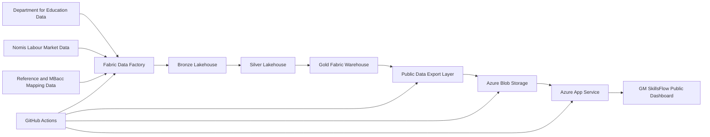
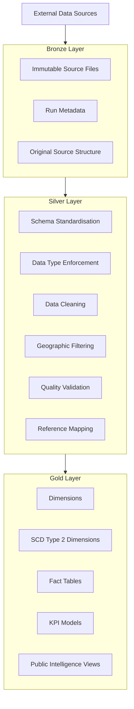
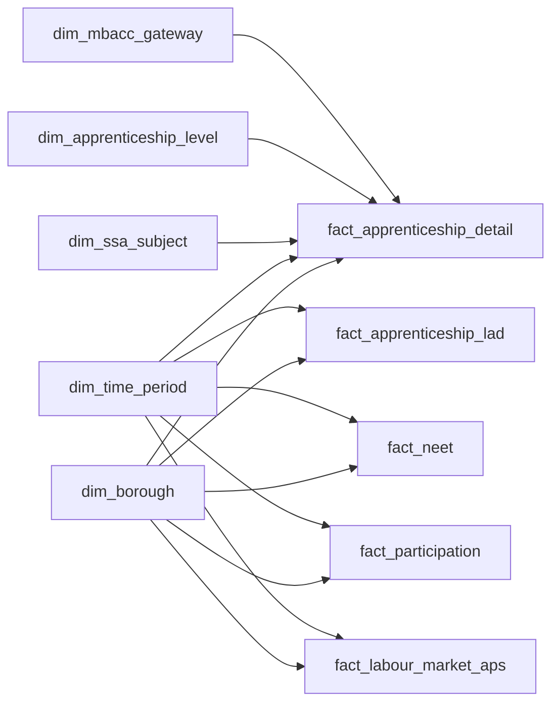
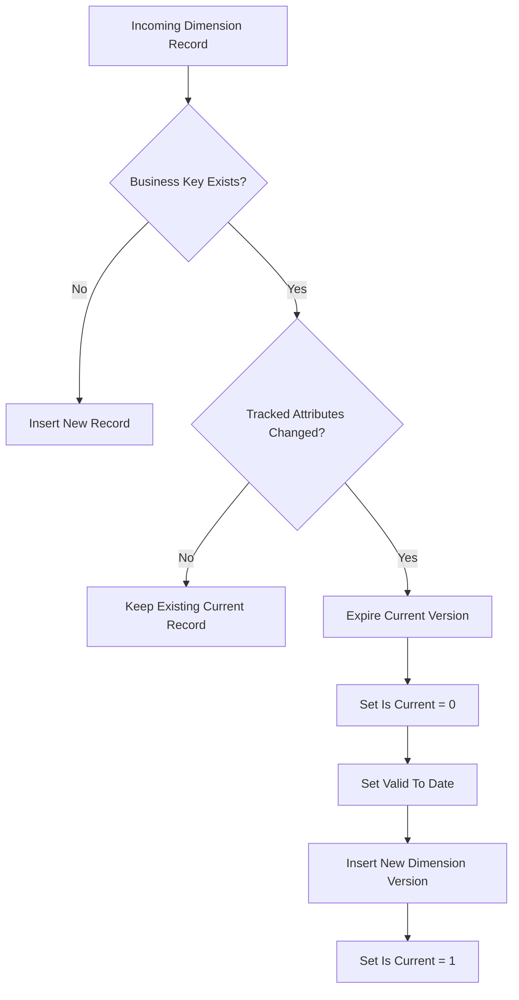
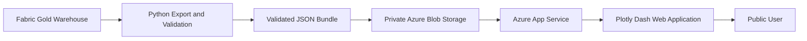
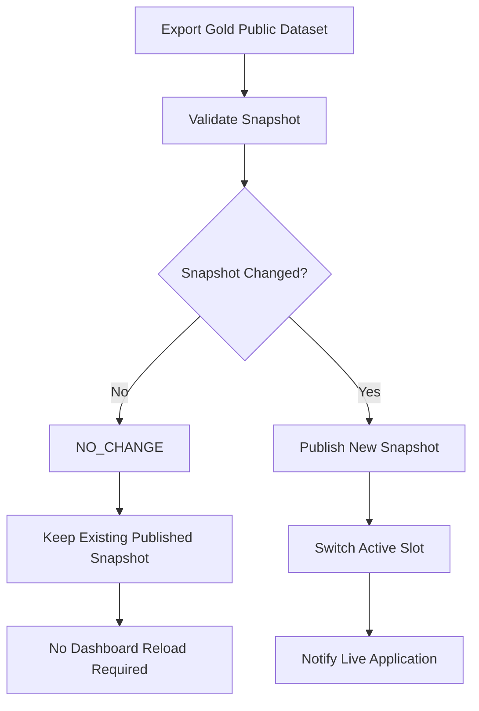
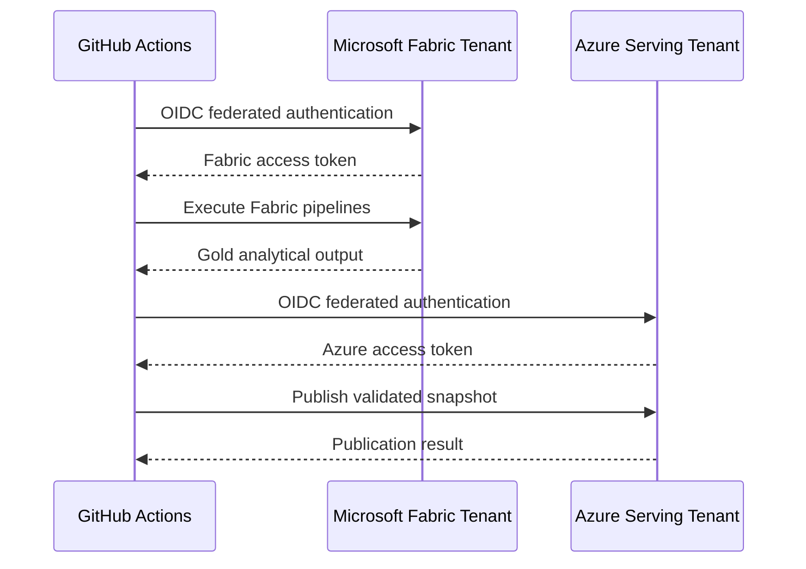
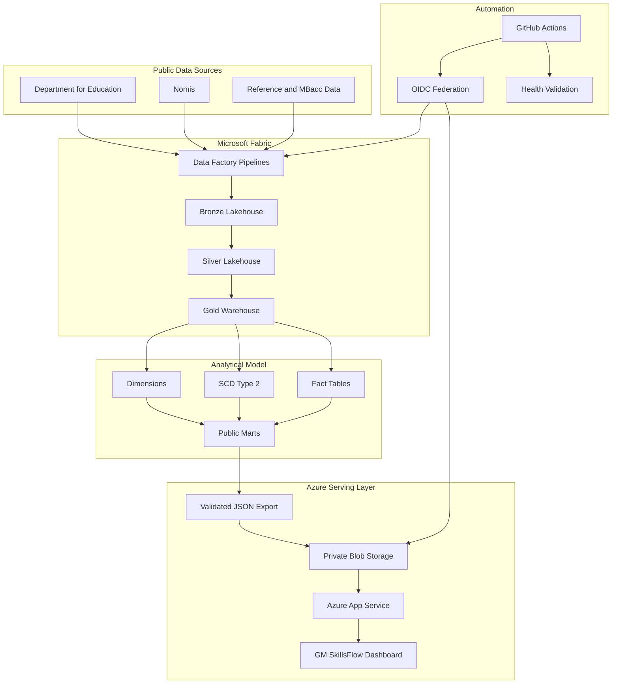

# Greater Manchester Skills & Opportunity Intelligence

**GM SkillsFlow** is an end to end data engineering, analytics and public intelligence platform for understanding skills development, apprenticeships, youth transition and labour market conditions across Greater Manchester.

The platform combines data from multiple public data sources, processes them through a Microsoft Fabric Medallion architecture, builds governed analytical fact and dimension models, publishes validated public datasets, and serves the resulting intelligence through a live Azure hosted web application.

The project demonstrates a complete production style workflow covering:

- Multi source data ingestion
- Microsoft Fabric Data Factory pipelines
- Bronze, Silver and Gold data architecture
- Data cleansing and standardisation
- Dimensional modelling
- Slowly Changing Dimension Type 2 management
- Fact table engineering
- Data quality validation
- Microsoft Fabric Warehouse
- Python based public data export
- Azure Blob Storage serving
- Azure App Service deployment
- GitHub Actions automation
- Workload identity federation using OpenID Connect
- Change aware public snapshot publishing
- Automated health validation

---

# Project Overview

Greater Manchester has a complex relationship between education, apprenticeships, youth participation and labour market demand.

Relevant information exists across different public datasets, reporting periods and administrative structures. This project brings those datasets together into a common analytical platform.

The platform is designed to answer questions such as:

> How are apprenticeship outcomes changing across Greater Manchester?

> Which boroughs show stronger or weaker youth transition outcomes?

> How does labour market participation differ between boroughs?

> Which skills and apprenticeship subject areas are more strongly represented?

> How can education, employment and skills indicators be viewed together rather than through isolated datasets?

The objective is not simply to visualise data.

The project demonstrates how heterogeneous public datasets can be engineered into a governed analytical platform with repeatable ingestion, transformation, modelling, validation, publication and deployment.

---

# High Level Architecture



The architecture separates source ingestion, data engineering, analytics modelling and public serving.

This prevents the live dashboard from querying operational source systems directly and provides a controlled path from raw source data to public intelligence.

---

# End to End Data Flow

```text
Public Data Sources
        │
        ├── Department for Education
        │      ├── Apprenticeship data
        │      ├── Youth NEET indicators
        │      └── Participation indicators
        │
        ├── Nomis
        │      └── Annual Population Survey labour market indicators
        │
        └── Reference Data
               └── MBacc gateway and subject mappings
        │
        ▼
Microsoft Fabric Data Factory
        │
        ▼
┌──────────────────────────────────────┐
│             BRONZE                   │
│ Immutable source snapshots           │
│ Raw ingestion and source retention   │
└──────────────────────────────────────┘
        │
        ▼
┌──────────────────────────────────────┐
│             SILVER                   │
│ Cleaning                             │
│ Standardisation                      │
│ Data quality                         │
│ Geographic alignment                 │
│ Schema harmonisation                 │
└──────────────────────────────────────┘
        │
        ▼
┌──────────────────────────────────────┐
│              GOLD                    │
│ Dimensions                           │
│ SCD Type 2 history                   │
│ Fact tables                          │
│ KPI models                           │
│ Borough intelligence                 │
└──────────────────────────────────────┘
        │
        ▼
Validated Public JSON Export
        │
        ▼
Azure Blob Storage
        │
        ▼
Azure App Service
        │
        ▼
GM SkillsFlow Dashboard
```

---

# Data Sources

The platform integrates information from several independent sources rather than relying on a single dataset.

## Department for Education

Department for Education datasets provide education and youth transition information used by the platform.

The ingestion layer processes datasets including:

- Apprenticeship participation and achievement data
- Apprenticeship subject and level information
- NEET and Not Known indicators
- Participation indicators
- Local authority level education statistics

These datasets provide the education and skills supply component of the analytical model.

## Nomis

Nomis provides labour market statistics used to complement the education datasets.

Annual Population Survey data is used to provide labour market indicators across Greater Manchester.

This enables the platform to connect skills and education information with wider employment and economic participation measures.

## Reference and Mapping Data

Additional reference datasets are used to create consistent analytical classifications.

These include:

- Greater Manchester borough mappings
- Apprenticeship level classifications
- Sector Subject Area mappings
- MBacc gateway mappings
- Geographic reference information

Reference data ensures that independently published datasets can be analysed using common dimensions.

---

# Microsoft Fabric Medallion Architecture

The engineering platform follows a Bronze, Silver and Gold design.



---

# Bronze Layer

The Bronze layer preserves the source data in its original or near original structure.

Source snapshots are stored immutably so previous source states remain available for:

- Audit
- Reprocessing
- Troubleshooting
- Data lineage
- Historical comparison

A new ingestion run therefore does not destroy previously acquired source evidence.

The Bronze layer acts as the system of record for data received from external providers.

---

# Silver Layer

The Silver layer converts heterogeneous source datasets into governed analytical tables.

Typical Silver transformations include:

```text
Raw field names
      ↓
Standard column naming
      ↓
Data type conversion
      ↓
Missing value handling
      ↓
Greater Manchester filtering
      ↓
Local authority normalisation
      ↓
Subject and level mapping
      ↓
Data quality checks
      ↓
Curated Silver tables
```

The Silver model contains curated datasets for areas including:

```text
apprenticeship_lad
apprenticeship_detail
neet
participation
nomis_aps
mbacc_gateway
data_quality_result
```

This layer separates source specific structures from the downstream analytical model.

---

# Gold Analytical Model

The Gold layer is implemented in Microsoft Fabric Warehouse.

It converts the curated Silver datasets into a dimensional model suitable for analytics, public reporting and downstream application serving.

The model combines dimensions and fact tables rather than exposing raw operational structures directly to the dashboard.

---

# Dimensional Modelling

The analytical model includes dimensions such as:

```text
dim_borough
dim_mbacc_gateway
dim_ssa_subject
dim_time_period
dim_apprenticeship_level
```

Fact models contain measurable events and indicators including:

```text
fact_apprenticeship_lad
fact_apprenticeship_detail
fact_neet
fact_participation
fact_labour_market_aps
```

The relationship can be represented conceptually as:



This design makes it possible to analyse multiple datasets through shared business dimensions.

---

# Slowly Changing Dimensions

An important component of the Gold model is the implementation of **Slowly Changing Dimension Type 2**, or SCD Type 2.

SCD Type 2 is used where a dimension attribute may change over time but historical records must retain the version that existed when a fact was recorded.

The platform applies SCD Type 2 management to governed dimensions including:

```text
Borough
MBacc Gateway
Sector Subject Area
```

Instead of overwriting an existing dimension record when an attribute changes, the existing version is closed and a new version is created.

Conceptually:

```text
Original Dimension Record

Borough Key : 101
Borough     : Example Borough
Region      : Greater Manchester
Valid From  : 2024-01-01
Valid To    : 9999-12-31
Is Current  : 1


Attribute Changes
       │
       ▼


Historical Record

Borough Key : 101
Valid From  : 2024-01-01
Valid To    : 2026-09-19
Is Current  : 0


New Current Record

Borough Key : 102
Valid From  : 2026-09-20
Valid To    : 9999-12-31
Is Current  : 1
```

The process can also be represented as:



This preserves historical analytical integrity.

A historical fact can therefore continue referencing the dimension version that was valid at the time, while new facts can reference the new version.

---

# Fact Table Engineering

Fact tables store measurable indicators while dimensions provide analytical context.

For example:

```text
                  dim_time_period
                        │
                        │
dim_borough ───── fact_neet
                        │
                        │
                  NEET measures
```

and:

```text
                      dim_time_period
                            │
                            │
dim_borough ── fact_apprenticeship_detail ── dim_ssa_subject
                            │
                            │
                  dim_apprenticeship_level
                            │
                            │
                    dim_mbacc_gateway
```

This enables reusable cross dimensional analysis without duplicating descriptive information inside every fact table.

---

# Data Quality

Data quality validation is embedded into the transformation process.

Checks include areas such as:

- Required field validation
- Null detection
- Duplicate detection
- Expected geographic coverage
- Valid reference mapping
- Data type validation
- Row count validation
- Source completeness
- Mapping completeness
- Unexpected category detection

Quality outcomes are retained in the platform rather than existing only as temporary notebook output.

```text
Source Data
    │
    ▼
Validation Rules
    │
    ├── PASS ──→ Continue processing
    │
    └── FAIL ──→ Record quality result
                  and investigate
```

---

# MBacc Pathway Intelligence

The platform includes a governed MBacc mapping layer that associates apprenticeship subject areas with MBacc gateway classifications.

This provides an additional analytical view of skills pathways across Greater Manchester.

The mapping process distinguishes between:

```text
Mapped apprenticeship subjects
        │
        ├── MBacc gateway classification
        │
        └── analytical pathway
        

Intentionally unmapped subjects
        │
        └── retained and explicitly governed
```

Unmapped categories are therefore not silently discarded.

---

# Public Analytics Layer

The public dashboard does not connect directly to the Gold Warehouse.

Instead, selected analytical outputs are exported into validated JSON datasets.

Examples include:

```text
borough-current.json
borough-kpis.json
borough-opportunity.json
kpi-definitions.json
mbacc-pathways.json
metadata.json
skills-supply.json
youth-transition.json
```

This provides a controlled boundary between the analytical warehouse and the public application.

---

# Public Serving Architecture



Azure Blob Storage remains private.

The Azure App Service uses managed identity based access to read the published snapshot.

---

# Resilient Snapshot Publishing

Public dashboard data is published using a two slot snapshot model.

```text
                  manifest.json
                       │
                       ▼
                  active_slot
                       │
             ┌─────────┴─────────┐
             │                   │
          slot-a              slot-b
             │                   │
       snapshot files       snapshot files
```

A new validated snapshot is written to the inactive slot first.

Only after validation succeeds is the manifest switched to the new active slot.

This reduces the risk of users seeing partially published datasets.

---

# Change Aware Publishing

The public serving layer includes a `NO_CHANGE` mechanism.

After the Gold model is exported, the generated public snapshot is compared with the currently published version.



This means the scheduled pipeline can execute normally while the public application remains unchanged when the resulting data contains no material differences.

This avoids unnecessary public snapshot replacement.

---

# Automation

Production refresh is orchestrated using GitHub Actions.

The workflow runs:

```text
GitHub Actions
      │
      ▼
Authenticate to Microsoft Fabric
      │
      ▼
Acquire Fabric Warehouse SQL token
      │
      ▼
Bind pipelines to automation identity
      │
      ▼
Run DfE ingestion
      │
      ▼
Run Nomis ingestion
      │
      ▼
Bronze → Silver
      │
      ▼
Silver analytical modelling
      │
      ▼
Silver → Gold
      │
      ▼
Export validated public snapshot
      │
      ▼
Authenticate to Azure serving tenant
      │
      ▼
Publish if changed
      │
      ▼
Refresh live application
      │
      ▼
Verify application health
```

The production workflow is scheduled daily using:

```yaml
schedule:
  - cron: "30 5 * * *"
```

The workflow can also be started manually through GitHub Actions.

---

# Secure Cross Tenant Automation

The platform operates across separate Microsoft environments.

Microsoft Fabric processing and Azure public serving use different identities.

Authentication is implemented using GitHub Actions OpenID Connect rather than storing long lived Azure passwords or client secrets in the repository.



The Fabric automation identity is granted access only to the resources required for pipeline execution.

The Azure serving automation identity has permission to publish to the designated Blob Storage container.

The live web application uses a separate managed identity with read access.

---

# Production Workflow

The complete production sequence is:

```text
┌──────────────────────────────┐
│       GitHub Actions         │
└──────────────┬───────────────┘
               │
               ▼
┌──────────────────────────────┐
│        DfE Ingestion         │
└──────────────┬───────────────┘
               │
               ▼
┌──────────────────────────────┐
│       Nomis Ingestion        │
└──────────────┬───────────────┘
               │
               ▼
┌──────────────────────────────┐
│        Bronze Layer          │
└──────────────┬───────────────┘
               │
               ▼
┌──────────────────────────────┐
│        Silver Layer          │
└──────────────┬───────────────┘
               │
               ▼
┌──────────────────────────────┐
│     Gold Fabric Warehouse    │
└──────────────┬───────────────┘
               │
               ▼
┌──────────────────────────────┐
│     Public JSON Export       │
└──────────────┬───────────────┘
               │
               ▼
        Has Data Changed?
          │          │
         NO         YES
          │          │
          ▼          ▼
     NO_CHANGE    Publish
          │          │
          │          ▼
          │    Azure Blob Storage
          │          │
          │          ▼
          └────► Azure App Service
                        │
                        ▼
                  Public Dashboard
```

---

# Dashboard

The public application is implemented using Plotly Dash.

The application provides several analytical views:

```text
Overview
│
├── Borough Explorer
│
├── MBacc Pathways
│
├── Trends
│
└── Data & Methodology
```

The dashboard is designed to expose analytical outputs rather than raw source data.

The application reads the currently active validated snapshot from the serving layer.

---

# Live Application

The deployed GM SkillsFlow application is available at:

https://gm-skillsflow-kamil-898341.azurewebsites.net

Application health can be checked at:

https://gm-skillsflow-kamil-898341.azurewebsites.net/healthz

---

# Repository Structure

```text
greater-manchester-skills-opportunity-intelligence/
│
├── .github/
│   └── workflows/
│       └── production_refresh.yml
│
├── architecture/
│
├── config/
│
├── dashboard/
│   ├── assets/
│   ├── components/
│   └── pages/
│
├── docs/
│
├── fabric/
│   ├── notebooks/
│   └── pipelines/
│
├── scripts/
│   ├── export_public_dashboard_data.py
│   ├── fabric_run.py
│   ├── publish_public_snapshot.py
│   └── run_refresh_chain.py
│
├── sql/
│   ├── ddl/
│   ├── dimensions/
│   ├── facts/
│   ├── mart/
│   └── quality/
│
├── src/
│   └── gm_skills/
│
├── tests/
│
├── web/
│
├── pyproject.toml
├── requirements.txt
├── startup.sh
└── README.md
```

---

# Technology Stack

| Layer | Technology |
|---|---|
| Source ingestion | Microsoft Fabric Data Factory |
| Data lake | Microsoft Fabric Lakehouse |
| Transformation | Python, PySpark, Fabric Notebooks |
| Analytical storage | Microsoft Fabric Warehouse |
| Data modelling | SQL, dimensional modelling, SCD Type 2 |
| Data quality | Python, SQL, validation controls |
| Public export | Python |
| Cloud storage | Azure Blob Storage |
| Web application | Plotly Dash |
| Hosting | Azure App Service |
| Automation | GitHub Actions |
| Authentication | Microsoft Entra ID, OIDC, Managed Identity |
| Version control | Git and GitHub |

---

# Engineering Principles

The platform was designed around several engineering principles.

### Separation of concerns

Source ingestion, data transformation, analytical modelling and public serving operate as separate layers.

### Reproducibility

Source snapshots and transformation logic are retained so analytical results can be reproduced.

### Auditability

Bronze source preservation, run metadata and data quality outputs provide traceability.

### Historical integrity

SCD Type 2 modelling allows important dimension changes to be retained rather than overwritten.

### Security

Long lived cloud credentials are avoided where possible through federated identity and managed identity.

### Resilience

Two slot public snapshot publishing reduces the risk of exposing incomplete datasets.

### Controlled publication

Only validated analytical outputs are exposed to the public application.

### Change awareness

A public snapshot is not replaced when no material change is detected.

---

# Current Loading Strategy

The current implementation deliberately favours reliability and traceability over premature optimisation.

Each scheduled refresh:

```text
Rechecks source datasets
        ↓
Creates or evaluates source snapshots
        ↓
Processes the current Silver analytical state
        ↓
Refreshes the Gold analytical model
        ↓
Exports the public dataset
        ↓
Publishes only when the public output changes
```

A future enhancement could introduce source level watermark based incremental ingestion and Delta `MERGE` processing.

This was intentionally not introduced into the current implementation because the existing architecture provides a clear, reproducible and operationally stable baseline.

---

# Potential Future Enhancements

Potential extensions include:

- Source level incremental loading using persistent watermarks
- Delta based Silver `MERGE` processing
- Incremental Gold fact loading
- Additional Greater Manchester skills datasets
- Vacancy and occupational demand intelligence
- Qualification supply and demand comparison
- Forecasting of apprenticeship participation
- Labour market trend forecasting
- Automated anomaly detection
- Microsoft Power BI semantic model
- Additional API serving endpoints
- Infrastructure as Code
- Automated data lineage reporting
- Expanded observability and alerting

---

# Project Value

GM SkillsFlow demonstrates how fragmented public education and labour market datasets can be transformed into a coherent intelligence platform.

The project goes beyond dashboard development by demonstrating the complete analytical engineering lifecycle:

```text
Acquire
   ↓
Preserve
   ↓
Clean
   ↓
Validate
   ↓
Model
   ↓
Historise
   ↓
Analyse
   ↓
Publish
   ↓
Serve
   ↓
Automate
   ↓
Monitor
```

It combines data engineering, analytics engineering, cloud architecture, dimensional modelling, automation and application deployment within one production style project.

---

# Architecture Summary



---

# Author and Modeller

**Kamil Ridwan Kehinde**

Energy Systems Scientist  
Data Intelligence and Forecasting Analyst  
Data Engineering and Applied Artificial Intelligence

Areas of interest include:

- Energy systems analytics
- Forecasting
- Data engineering
- Artificial intelligence
- Cloud analytics
- Public infrastructure intelligence
- Microsoft Fabric
- Azure
- Python
- SQL
- Power BI

---

# Disclaimer

This project is developed for research, analytical engineering and portfolio demonstration purposes.

It uses publicly available data and should not be interpreted as an official Greater Manchester, Department for Education, Nomis or government reporting service.

Users requiring official statistics should consult the original publishing organisations.
